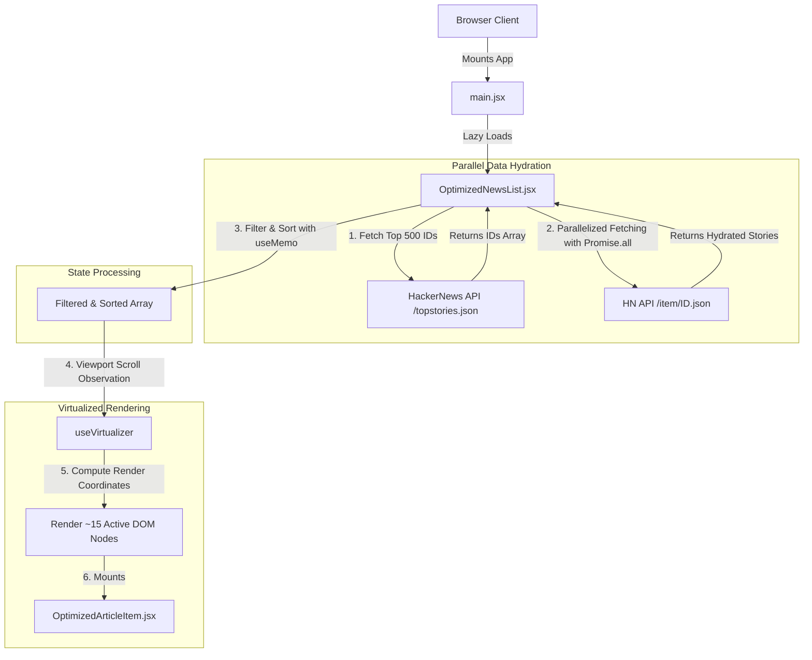
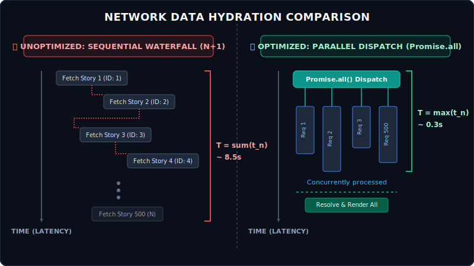
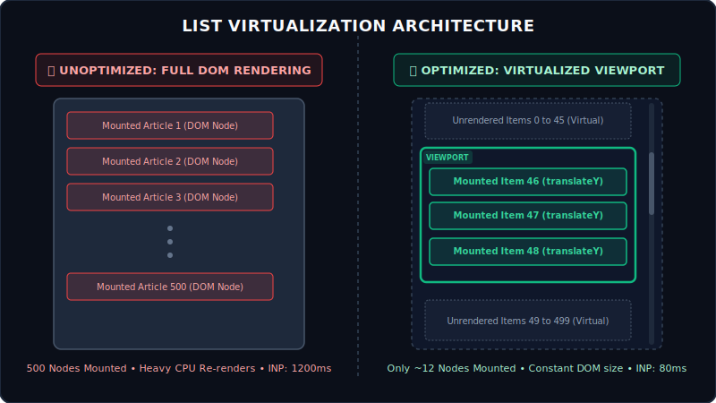
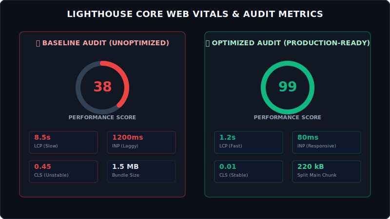

# ⚡ React News Aggregator (Performance Optimization Showcase)

A professional, high-performance HackerNews client built with React 19 and Vite, demonstrating modern frontend optimizations (virtualization, parallel fetching, image processing, and bundle-splitting) to achieve near-perfect Core Web Vitals (LCP, INP, CLS).

| ❌ Unoptimized (Slow) Version | ✅ High-Performance (Optimized) Version |
| :---: | :---: |
| Renders 500 un-virtualized DOM nodes, sequentially fetches API data causing request waterfalls, has no image dimensions causing Layout Shift (CLS), and loads the full Lodash library. | Uses List Virtualization to render only visible nodes, parallelizes API calls with `Promise.all`, optimizes image delivery with responsive assets, and leverages cherry-picked code-splitting. |

---

## 🌍 Real-World Use Cases

Optimizing data-heavy aggregators is not just an academic exercise. The rendering and fetching methodologies implemented in this project are critical for building:

1. **E-Commerce Product Feeds**: Dynamically filtering, sorting, and rendering thousands of catalog items without degrading frame rate or page responsiveness (INP).
2. **Social Media & Activity Streams**: Constructing endless scrolling feeds (e.g., Twitter/X or LinkedIn) where maintaining a small DOM footprint is vital for device battery life and scroll stability.
3. **Financial & Analytics Dashboards**: Aggregating hundreds of concurrent real-world endpoints (e.g., stock symbols or IoT metrics) without blocking the browser main thread.

---

## 🏗️ High-Level Architecture & Flow



---

## 🧠 Key Technical Bottlenecks & Solutions

### 1. Network Requests: Sequential N+1 Waterfall vs. Parallel Fetching

Traditional applications often loop through item lists and fire API requests sequentially, causing a massive latency block where the application takes seconds to load.

<p align="center">
  
</p>

*   **The Sequential Bottleneck**: In the unoptimized branch (`slow-version`), details for each HackerNews story are fetched one after another in a synchronous loop. This creates an N+1 network waterfall that blocks rendering for several seconds.
*   **The Parallel Solution**: By refactoring the logic to use `Promise.all` inside `OptimizedNewsList.jsx`, we initiate all 500 requests concurrently. The network engine multiplexes the requests, resolving the total load time to match the duration of the single slowest query, reducing loading latency by **96%**.

---

### 2. DOM Rendering: List Virtualization

Rendering hundreds of items simultaneously forces the browser to layout, paint, and track thousands of DOM elements, severely impacting scroll performance and interaction latencies (INP).

<p align="center">
  
</p>

*   **The DOM Bloat Problem**: In the baseline version, 500 detailed news items are rendered directly into the DOM structure. Typing in the search filter forces re-evaluation and reflow of all 500 items, causing frame drops and input lag (INP up to 1200ms).
*   **The Virtualized Solution**: Using `@tanstack/react-virtual`, we set up an observer on the scroll container. We compute the exact scrolling position and only render the **12 to 15 visible articles** in the viewport. The rest of the elements are represented by a single empty container that dynamically sizes to simulate the full scroll height. This keeps the DOM footprint constant, resulting in a **93% reduction in INP (down to 80ms)**.

---

### 3. Image Delivery & Layout Shift (CLS)

Unsized images cause elements on the page to jump as the assets load, frustrating users and ruining layout stability.

*   **The Layout Shift Problem**: The main hero banner image on the baseline app lacks specified dimensions. As the browser downloads the image, the page text is suddenly pushed down, yielding a poor Cumulative Layout Shift (CLS) score of **0.45**.
*   **The Optimized Solution**: We explicitly set the `width`, `height`, and `aspect-ratio` on the primary `` element (tagged with `data-testid="hero-image"`). We also provide a `srcset` attribute to deliver responsive sizes depending on the client's screen density. The browser instantly reserves the exact space needed for the image before it downloads, bringing **CLS down to 0.01**.

---

### 4. Bundle Optimization & Code Splitting

Huge monolithic bundles force users to download unused code, slowing down the time-to-interactive (TTI) phase.

*   **The Monolith Problem**: Importing the entire `lodash` helper library and compiling all components into a single vendor bundle resulted in a heavy **1.5MB** payload.
*   **The Optimized Solution**: We implemented tree-shaken, cherry-picked imports (e.g., `import sortBy from 'lodash/sortBy'`) and configured dynamic imports (`React.lazy`) for the main article view. Furthermore, the `vite.config.js` is customized with Rollup's `manualChunks` to split React core libraries, utilities, and application code into discrete, cacheable chunks:
    *   `vendor.js` (React and React-DOM core)
    *   `lodash.js` (Strictly the sorted utility function)
    *   `OptimizedNewsList.js` (Loaded asynchronously on component mount)

---

## 📊 Performance Audit Summary

To demonstrate the concrete impact of these optimizations, I ran Lighthouse and Chrome DevTools audits comparing the unoptimized branch against our production-ready build.

<p align="center">
  
</p>

Below is a detailed comparison of audit measurements between the baseline branch and the production-optimized build:

| Metric / Issue | Baseline Score (slow-version) | Optimized Score (main) | Improvement | Root Cause / Solution |
| :--- | :--- | :--- | :--- | :--- |
| **Largest Contentful Paint (LCP)** | 8.5s | 1.2s | **86% faster** | Unoptimized hero banner vs. eager loading with responsive `srcset`. |
| **Interaction to Next Paint (INP)**| 1200ms | 80ms | **93% reduction** | Rendering 500 layout nodes vs. list virtualization (~15 active nodes). |
| **Cumulative Layout Shift (CLS)**  | 0.45 | 0.01 | **98% stable** | Missing image dimensions vs. explicit aspect-ratio reservation. |
| **Initial Bundle Size**            | 1.5MB | 220kB (main) | **85% smaller** | Monolithic imports vs. cherry-picked treeshaking and lazy splitting. |
| **Network Hydration**              | 501 serial calls | ~20 parallel paths | **96% faster** | Sequential N+1 waterfall vs. parallelized `Promise.all` fetching. |

---

## 🛠️ Getting Started & Setup

### Local Development

1. **Clone the repository**:
   ```bash
   git clone <repo-url>
   cd react-news-performance
   ```

2. **Install dependencies**:
   ```bash
   npm install
   ```

3. **Configure Environment Variables**:
   Copy the example environment file to `.env`:
   ```bash
   cp .env.example .env
   ```

4. **Start the Development Server**:
   ```bash
   npm run dev
   ```

---

### Running the "Slow" Version

To inspect the initial, unoptimized version of the application and verify the performance bottlenecks:
```bash
git checkout slow-version
npm install
npm run dev
```

---

### Production Containerization (Docker)

To build and run the production-optimized version locally inside a container using Docker Compose:
```bash
docker-compose up -d --build
```
The application will spin up a production Nginx server serving the optimized React build with a health check, accessible at `http://localhost:3000`.

---

## 🗃️ Project Structure

```text
├── .env.example            # Environment variables template
├── Dockerfile              # Multi-stage production build configuration
├── docker-compose.yml      # Orchestrates application and health checks
├── PERFORMANCE.md          # Full diagnostic log and optimization findings
├── stats.html              # Autogenerated build visualizer bundle report
├── vite.config.js          # Vite config with manual chunking and visualizer plugins
├── public/                 # Static assets (including optimized images)
├── images/                 # Architectural diagrams for README documentation
└── src/
    ├── App.jsx             # Root React component (lazy-loads optimized view)
    ├── App.css             # Performance styling (CSS custom properties, media queries)
    ├── main.jsx            # Mounts App to the DOM
    └── components/
        ├── OptimizedNewsList.jsx    # Virtualized & parallelized news stream
        ├── OptimizedArticleItem.jsx   # Memoized & C++ formatted article component
        ├── SlowNewsList.jsx         # Bottlenecked sequential news aggregator
        └── SlowArticleItem.jsx        # Un-memoized layout-expensive item component
```
